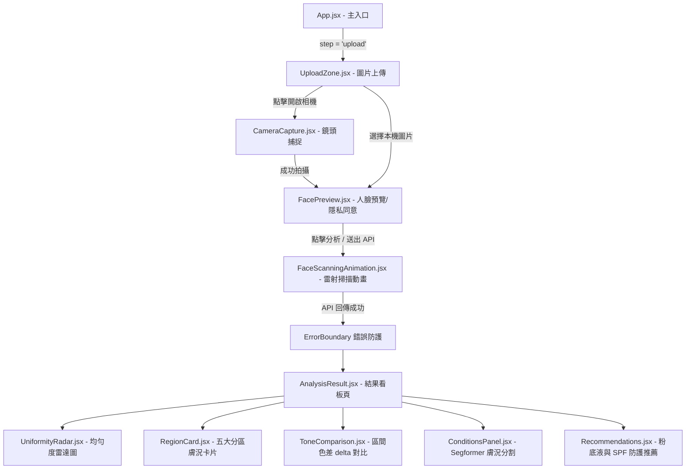

# Lumière 專案 結構與資料對照檢查報告

本報告針對 Lumière 前端專案進行了原始碼深入盤點，提供「前端檔案與元件架構」及「後端 API 資料結構」兩大維度的詳細清單，作為後續 React 網頁優化與 Flutter APP 映射開發的基礎對照依據。

---

## 1. 前端檔案與元件架構盤點 (Component Mapping)

### 核心功能元件分類與路徑
專案前端架構採用模組化元件設計，每個功能元件皆獨立成資料夾，包含其同名的 `.jsx` 程式碼與對應的 `.css` 樣式檔。

*   **圖片上傳/相機拍攝 (Image Upload & Capture)**
    *   **上傳拖曳區：** [UploadZone.jsx](file:///L:/Lumiere/Front_Lumiere/src/components/UploadZone/UploadZone.jsx) (樣式：[UploadZone.css](file:///L:/Lumiere/Front_Lumiere/src/components/UploadZone/UploadZone.css))
        *   *職責：* 處理圖片檔案拖曳與選擇，限制檔案格式為 JPEG/PNG/WebP，限制大小最大 10MB。
    *   **相機串流與拍照：** [CameraCapture.jsx](file:///L:/Lumiere/Front_Lumiere/src/components/CameraCapture/CameraCapture.jsx) (樣式：[CameraCapture.css](file:///L:/Lumiere/Front_Lumiere/src/components/CameraCapture/CameraCapture.css))
        *   *職責：* 調用瀏覽器相機串流 API，繪製人臉对齊框 (Oval Cutout Mask)，處理拍照並傳回 blob 圖片資料。配合 [useCamera.js](file:///L:/Lumiere/Front_Lumiere/src/hooks/useCamera.js) Hook 管理相機生命週期。
    *   **人臉預覽與授權：** [FacePreview.jsx](file:///L:/Lumiere/Front_Lumiere/src/components/FacePreview/FacePreview.jsx) (樣式：[FacePreview.css](file:///L:/Lumiere/Front_Lumiere/src/components/FacePreview/FacePreview.css))
        *   *職責：* 顯示拍照或上傳之圖片。整合了 GDPR 同意書全螢幕彈跳視窗（Modal Popup），使用者在首次進入預覽頁時會自動彈出，必須將條款滾動至最底部，右上角關閉 (X) 按鈕方會解除禁用狀態。在主畫面勾選框下方新增了「詳細條款」超連結供使用者重新喚醒彈窗。條款段落採用字元左右對齊（`text-align: justify`），且在行動端（<640px）對預覽相片採用了 4:3 黃金比例佈局（Option B）以防止人臉裁剪，在桌機端則透過 1:1 等寬等高對稱 Grid 自動填滿。

*   **AI 分析等待畫面 (AI Analyzing Screen)**
    *   **動態掃描動畫：** [FaceScanningAnimation.jsx](file:///L:/Lumiere/Front_Lumiere/src/components/FaceScanningAnimation/FaceScanningAnimation.jsx) (樣式：[FaceScanningAnimation.css](file:///L:/Lumiere/Front_Lumiere/src/components/FaceScanningAnimation/FaceScanningAnimation.jsx))
        *   *職責：* 於分析中顯示掃描雷射光束與動態光圈動畫。
    *   **備用載入轉圈：** [LoadingSpinner.jsx](file:///L:/Lumiere/Front_Lumiere/src/components/LoadingSpinner/LoadingSpinner.jsx) (樣式：[LoadingSpinner.css](file:///L:/Lumiere/Front_Lumiere/src/components/LoadingSpinner/LoadingSpinner.css))
        *   *職責：* 輕量級的載入動態，用於部分非掃描時段的狀態過渡。

*   **結果與推薦顯示 (Result & Recommendation Dashboard)**
    *   **主控面板：** [AnalysisResult.jsx](file:///L:/Lumiere/Front_Lumiere/src/components/AnalysisResult/AnalysisResult.jsx) (樣式：[AnalysisResult.css](file:///L:/Lumiere/Front_Lumiere/src/components/AnalysisResult/AnalysisResult.css))
        *   *職責：* 分析結果的統整看板，解析 API 回傳欄位並分發資料給各個子元件。不再採用內嵌警告欄，而是採用全螢幕高斯模糊（backdrop-filter: blur）效果的免責聲明彈窗 (Medical Warning Modal Popup)，內文與建議段落均設為左右對齊（justify），需要使用者點擊確認後方可檢視數據，提升合規嚴謹性。
    *   **雷達均勻度圖表：** [UniformityRadar.jsx](file:///L:/Lumiere/Front_Lumiere/src/components/UniformityRadar/UniformityRadar.jsx) (樣式：[UniformityRadar.css](file:///L:/Lumiere/Front_Lumiere/src/components/UniformityRadar/UniformityRadar.css))
        *   *職責：* 使用 Recharts 套件，繪製前額、雙頰、鼻子、下巴五個區域的均勻度雷達圖，圖表標題與 Tooltip 字樣均已實現多語系支援。
    *   **分區膚質卡片：** [RegionCard.jsx](file:///L:/Lumiere/Front_Lumiere/src/components/RegionCard/RegionCard.jsx) (樣式：[RegionCard.css](file:///L:/Lumiere/Front_Lumiere/src/components/RegionCard/RegionCard.css))
        *   *職責：* 顯示單一臉部區域的 Fitzpatrick 膚色分類、出油度等級、特定瑕疵標籤與備註。內置備註對譯表，切換語系時卡片備註（notas）可即時動態對譯。
    *   **膚色色差比對：** [ToneComparison.jsx](file:///L:/Lumiere/Front_Lumiere/src/components/ToneComparison/ToneComparison.jsx) (樣式：[ToneComparison.css](file:///L:/Lumiere/Front_Lumiere/src/components/ToneComparison/ToneComparison.css))
        *   *職責：* 比對各區之間的色差 delta 值，並呈現長條圖級距。
    *   **膚質狀況細節面板：** [ConditionsPanel.jsx](file:///L:/Lumiere/Front_Lumiere/src/components/ConditionsPanel/ConditionsPanel.jsx) (樣式：[ConditionsPanel.css](file:///L:/Lumiere/Front_Lumiere/src/components/ConditionsPanel/ConditionsPanel.css))
        *   *職責：* 用於渲染 Segformer 模型所分割出的異常膚況指標 (例如 Melasma 斑點、Vitiligo 白斑、Wine Stain 胎記) 之比例與受影響區塊。膚況名稱均整合至多語系字典。
    *   **美妝推薦元件：** [Recommendations.jsx](file:///L:/Lumiere/Front_Lumiere/src/components/Recommendations/Recommendations.jsx) (樣式：[Recommendations.css](file:///L:/Lumiere/Front_Lumiere/src/components/Recommendations/Recommendations.css))
        *   *職責：* 依據膚況與副色調進行粉底液色號匹配，並整合 SPF 防護建議、校色遮瑕步驟 (Color Corrector Step) 以及皮膚學測試徽章 (Dermatologically Tested)。商品卡片排版經重構，徽章獨立放置於品牌名稱正下方，解決與品牌名字擠壓重疊的排版偏差。

*   **錯誤處理 (Error Handling)**
    *   **元件級渲染錯誤防護：** [ErrorBoundary.jsx](file:///L:/Lumiere/Front_Lumiere/src/components/ErrorBoundary/ErrorBoundary.jsx) (樣式：[ErrorBoundary.css](file:///L:/Lumiere/Front_Lumiere/src/components/ErrorBoundary/ErrorBoundary.css))
        *   *職責：* 捕捉 [AnalysisResult.jsx](file:///L:/Lumiere/Front_Lumiere/src/components/AnalysisResult/AnalysisResult.jsx) 或其子元件在解析資料/繪圖時發生的 JS 執行期崩潰，避免影響整個應用程式，並提供 Try Again 按鈕重新發起上傳。
    *   **網路與 API 狀態錯誤：**
        *   程式碼位於 [useAnalysis.js](file:///L:/Lumiere/Front_Lumiere/src/hooks/useAnalysis.js#L20-L29)，捕捉 Axios 請求異常並解析 HTTP Code，隨後將錯誤字串儲存於 `error` 狀態中，由 [App.jsx](file:///L:/Lumiere/Front_Lumiere/src/App.jsx#L113-L120) 在主畫面上顯示錯誤重試按鈕。

---

### 全域樣式與色調控制
本專案**未使用 TailwindCSS**，亦無 JavaScript 導出的 `theme.js` 檔案。所有的全域樣式與主色調完全由 CSS 自定義屬性 (CSS Custom Properties) 控制：

*   **全域控制檔案：** [App.css](file:///L:/Lumiere/Front_Lumiere/src/App.css#L1-L32)
*   **關鍵色調變數清單：**
    *   `--color-primary: #8C6239` (主色調：暖栗棕，用於主要標題、邊框、重要標籤)
    *   `--color-accent: #D4A373` (輔助/高亮色：琥珀金，專用於主要行動按鈕/強調按鈕)
    *   `--color-accent-light: #F5EBE0` (輕透變體：杏仁奶白淺色變體)
    *   `--color-background: #F5EBE0` (全域背景色：杏仁奶白，用於全域背景與閱讀區域背景)
    *   `--color-surface: #FFFFFF` (容器背景色：純白，用於在背景上隔離卡片/彈窗)
    *   `--color-text: #2D2D2D` (主字體顏色：深木炭色，用於主要段落)
    *   `--color-muted-text: #6B6B6B` (次級字體顏色：灰色，用於次要標籤或提示)
    *   `--color-border: #8C6239` (邊框色：暖栗棕細邊框)
    *   `--color-secondary: #1A365D` (輔助功能色：深海藍，嚴格保留給 AI 圖表、雷達圖與數據線)
    *   `--color-success: #2D6A4F` (成功測試徽章綠色)
    *   `--color-error: #C1121F` (錯誤/風險警示紅色)
    *   *相容性別名 (Compatibility Aliases)：*
        *   `--color-bg: var(--color-background)` (杏仁奶白背景)
        *   `--color-text-muted: var(--color-muted-text)` (灰色次級字體)
* font-sans: 'Noto Sans', 'Noto Sans TC', 'Noto Sans SC', system-ui, sans-serif;
---

### 路由與頁面結構 (SPA Route Flow)
本系統為**單頁面應用程式 (SPA)**，未導入 `react-router-dom` 套件，而是基於 `useState` 狀態來控制主要的步驟轉換：



---

## 2. 後端 API 資料結構盤點 (Data Schema Mapping)

### 核心分析 API 規格與呼叫處
*   **呼叫位置：** [api.js](file:///L:/Lumiere/Front_Lumiere/src/services/api.js#L20-L46)
*   **API 路徑：** `POST {VITE_API_URL}/api/analyze?lang={lang}`
*   **Content-Type：** `multipart/form-data`

#### Request 格式 (請求參數)
在前端封裝成 `FormData` 物件發送，同時配合語系代碼以 Query 參數傳輸：
| 參數名稱 | 位置 | 類型 | 說明 |
| :--- | :--- | :--- | :--- |
| `file` | Form-Data | `Binary (File)` | 使用者所上傳或由相機拍攝之人臉圖片二進位檔案。 |
| `lang` | Query Param | `String` | 當前語系代碼（`en`、`tw`、`zh`、`pt`、`fr`、`tr`），供後端 AI Prompt 作為生成備註時的目標語言標示。 |

#### Response 格式 (回傳 JSON 結構)
以下為從模組資料 [analysisResponse.js](file:///L:/Lumiere/Front_Lumiere/src/mocks/analysisResponse.js) 提煉出的完整 JSON 欄位結構：

```json
{
  "tom_geral_fitzpatrick": 4, // 整體膚色 Fitzpatrick 級數 (1~6)
  "subtom_predominante": "quente", // 主導副色調 ("quente"|冷 "frio"|中 "neutro")
  "tom_geral_hex": "#c68b6e", // 整體膚色 Hex 色值
  "skin_tone": {
    "median_hex": "#c68b6e", // 經臉部去背景分割後的代表膚色 Hex 值
    "median_rgb": [198, 139, 110] // 代表膚色的 RGB 陣列
  },
  "regioes": { // 臉部五大區域詳細結果
    "testa": { // 前額
      "tom_hex": "#c4856a",
      "tom_fitzpatrick": 4,
      "subtom": "quente",
      "oleosidade": "alta", // 出油度 ("seca"|"normal"|"mista"|"alta"|"muito_alta")
      "imperfeicoes": ["poro_dilatado", "brilho_excessivo"], // 瑕疵項目清單
      "uniformidade": 6.5, // 均勻度評分 (0.0 ~ 10.0)
      "notas": "Area with oily tendency and visible pores"
    },
    "bochecha_e": { ... }, // 左臉頰 (同上格式)
    "bochecha_d": { ... }, // 右臉頰 (同上格式)
    "nariz": { ... }, // 鼻子 (同上格式)
    "queixo": { ... } // 下巴 (同上格式)
  },
  "comparacao_tons": { // 各區域間色差對比
    "testa_vs_bochecha_e": {
      "delta": 8, // 色差 delta 值
      "nivel": "baixo" // 色差等級 ("baixo"|低, "moderado"|中, "alto"|高)
    },
    ...
  },
  "imperfeicoes": [ // 整體檢出之瑕疵摘要清單
    {
      "tipo": "poro_dilatado", // 瑕疵類型
      "intensidade": "moderada", // 嚴重度 ("leve", "moderada", "alta")
      "regiao": "testa" // 發生的臉部區域
    },
    ...
  ],
  "recommendations": [ // 粉底液商品色號匹配
    {
      "brand": "Fenty Beauty", // 品牌
      "shade_name": "340W", // 色號名稱
      "shade_code": "340W", // 色號代碼
      "undertone": "quente", // 商品對應副色調
      "fitzpatrick_range": [3, 4], // 適用 Fitzpatrick 區間
      "price_range": "$38–$42", // 價格區間
      "where_to_buy": "https://www.fentybeauty.com", // 導購連結
      "category": "foundation" // 商品類別
    }
  ],
  "medical_alert": { // 醫學免責提示 (若分析異常或膚況檢出觸發)
    "severity": "info", // 嚴重性級別 ("info", "warning", "critical")
    "title": "Not a medical diagnosis",
    "message": "Lumière provides cosmetic guidance...",
    "recommendation": "If you notice persistent, painful..."
  },
  "segformer_condition_map": { // Segformer 影像語意分割原始膚況欄位 (用於分析面板)
    "vitiligo": {
      "detected": true, // 是否檢測出白斑
      "area_percent": 4.8, // 佔全臉面積百分比
      "zones": ["left_cheek", "chin"] // 影響區域陣列
    },
    "melasma": { ... }, // 黃褐斑檢出資料
    "wine_stain": { ... } // 鮮紅斑痣 (胎記) 檢出資料
  },
  "condition_map": { // 化妝品防護規則邏輯判斷 (Boolean 簡化欄位，用於推薦攔截與橫幅警示)
    "melasma": false,
    "vitiligo": true,
    "wine_stain": false
  }
}
```

---

### 目標檢查欄位對照清冊
針對您提出的六個關鍵目標欄位，以下為目前 React 原始碼中的實際欄位名稱、所在結構階層，以及檢查結果：

1.  **`median_hex` (去背景中位數膚色 HEX 值)**
    *   *檢查結果：* **存在**。
    *   *實際名稱：* `median_hex`
    *   *階層路徑：* `result.skin_tone.median_hex`
    *   *說明：* 由 [AnalysisResult.jsx](file:///L:/Lumiere/Front_Lumiere/src/components/AnalysisResult/AnalysisResult.jsx#L125-L135) 取出後，被用來繪製「Healthy Skin Tone」色塊，並與整體 Fitzpatrick Hex 色塊對應展示。

2.  **`undertone` (副色調)**
    *   *檢查結果：* **部分命名不同**。
    *   *實際名稱與階層：*
        *   **整體 Predominant 副色調：** 實際名稱為 `subtom_predominante`，位於根階層 `result.subtom_predominante`（例如 `'quente'`）。
        *   **分區副色調：** 實際名稱為 `subtom`，位於區域資訊下 `result.regioes.<regiao_id>.subtom`。
        *   **美妝推薦的匹配副色調：** 實際名稱為 `undertone`，位於推薦品項陣列的個別項目下 `result.recommendations[i].undertone`。
    *   *語言對應：* 在 [translations.js](file:///L:/Lumiere/Front_Lumiere/src/i18n/translations.js#L93-L98) 中進行本地化轉換（例如 `quente` 轉換成 `Warm (golden, peachy, yellowish)`）。

3.  **`delta` (色差比對值)**
    *   *檢查結果：* **存在**。
    *   *實際名稱：* `delta`
    *   *階層路徑：* `result.comparacao_tons.<regiao_a>_vs_<regiao_b>.delta` (例如 `result.comparacao_tons.testa_vs_bochecha_e.delta`)
    *   *說明：* 數值介於 0~50 之間，並由 [colorUtils.js](file:///L:/Lumiere/Front_Lumiere/src/utils/colorUtils.js#L33-L36) 的 `deltaToPercent` 函數轉換為 0%~100% 的長條圖寬度，由 [ToneComparison.jsx](file:///L:/Lumiere/Front_Lumiere/src/components/ToneComparison/ToneComparison.jsx#L23) 使用。

4.  **`mancha_solar` (日曬斑瑕疵)**
    *   *檢查結果：* **存在**。
    *   *實際名稱：* `'mancha_solar'` (做為 imperfection type 字串使用)
    *   *所在位置：* 
        *   出現在臉部分區的瑕疵陣列中 `result.regioes.bochecha_e.imperfeicoes`
        *   出現在主要瑕疵清單中 `result.imperfeicoes[i].tipo`
    *   *說明：* 於 [colorUtils.js](file:///L:/Lumiere/Front_Lumiere/src/utils/colorUtils.js#L42) 中被翻譯映射為 `"Sun spot"`。

5.  **`vermelhidao` (泛紅/紅斑)**
    *   *檢查結果：* **未在當前 mockResponse 內，但在翻譯字典已預置**。
    *   *說明：* 雖然目前在 [analysisResponse.js](file:///L:/Lumiere/Front_Lumiere/src/mocks/analysisResponse.js) 的測試資料中沒有出現 `vermelhidao` 字串，但前端的國際化語系檔 [translations.js](file:///L:/Lumiere/Front_Lumiere/src/i18n/translations.js#L110) 中已明確定義了此 Key (如繁中對應為 `vermelhidao: '泛紅'`, 英文對應為 `vermelhidao: 'Redness'`)。因此，後端 API 若在瑕疵清單中傳回 `'vermelhidao'`，前端已具備完美接收並翻譯顯示的能力。

6.  **`brilho_excessivo` (出油反光)**
    *   *檢查結果：* **已修正拼寫**。
    *   *說明：* 原本翻譯檔中誤拼為 `brilho_excessive`（結尾為 `-e`），導致與後端傳回的標準鍵值 `brilho_excessivo` 不符而無法顯示中文。現已將全語系翻譯檔修正為 `brilho_excessivo`，在各語系中皆能正常對照翻譯。

7.  **`vitiligo` / `melasma` / `wine_stain` (異常膚況指標)**
    *   *檢查結果：* **已補齊翻譯字典**。
    *   *說明：* 原本 translations.js 中遺漏了 `conditions` 區塊，導致 Segformer 分割出之異常膚況（如 `vitiligo`）在卡片上顯示為原始英文 Key。現已部署全語系 `conditions` 翻譯對照表，使白斑症 (`vitiligo`) 等指標可正常漢化顯示。

8.  **Error Code (錯誤代碼)**
    *   *檢查結果：* **無專門的 Response 內嵌錯誤欄位，依賴標準 HTTP Status Code**。
    *   *實際實作方式：* 
        *   前端 Axios 發送請求後，於 [useAnalysis.js](file:///L:/Lumiere/Front_Lumiere/src/hooks/useAnalysis.js#L20-L29) 之 `catch` 區塊偵測伺服器回傳之 `status`：
            *   `413 Payload Too Large`：映照為 `t.errors.tooLarge` (圖片容量過大錯誤，即大於 10MB)。
            *   `422 Unprocessable Entity`：映照為 `t.errors.noFace` (無法辨識出臉部特徵錯誤)。
            *   其他錯誤狀態碼：映照為 `t.errors.generic` (一般系統/網路連線異常)。

---

> [!NOTE]
> **未來 Flutter APP 映射準備提示**
> - **單頁狀態狀態機設計：** Flutter App 可對照 `AppInner` 中的 `step` 與 `showCamera` 狀態，設計成對應的 Page 或 Nested Navigator 路由節點。
> - **語系資源共用：** [translations.js](file:///L:/Lumiere/Front_Lumiere/src/i18n/translations.js) 覆蓋了 6 種語系 (EN, PT, FR, ZH, TW, TR)，在設計 Flutter 的 `AppLocalizations` 時，可以直接參考或將此 JSON 導出為 ARB / JSON 語系設定檔。
